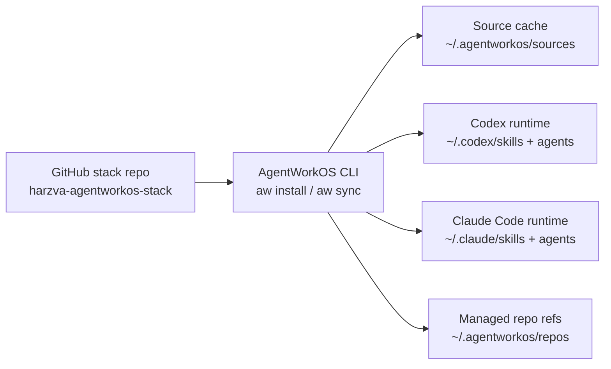

<div align="center">

# Harzva AgentWorkOS Stack

**A public, safe-core AgentOS environment manifest for restoring Harzva's Codex and Claude Code workspace.**

[](https://github.com/Harzva/AgentWorkOS)
[](https://github.com/Harzva/harzva-agentworkos-stack)
[](#runtime-targets)
[](#safety-boundaries)

[Quick restore](#quick-restore) · [Platform profiles](#platform-profiles) · [What it installs](#what-this-stack-installs) · [Runtime targets](#runtime-targets) · [Roadmp](#roadmp)

</div>

## What this is

`harzva-agentworkos-stack` is the portable environment declaration for a safe-core Harzva AgentOS setup.

It is not the AgentWorkOS package manager itself. The split is intentional:

| Repository | Role |
| --- | --- |
| [`Harzva/AgentWorkOS`](https://github.com/Harzva/AgentWorkOS) | Generic `aw` CLI, manifest format, lockfile, sync, install, and doctor commands. |
| [`Harzva/harzva-agentworkos-stack`](https://github.com/Harzva/harzva-agentworkos-stack) | Harzva's public-safe stack manifest for restoring skills, roles, terms, rules, and repo references. |
| `~/.codex`, `~/.claude` | Runtime projections generated from the stack. They are install targets, not the only source of truth. |

The goal is simple: make a new machine able to reconstruct the same public-safe AgentOS foundation from GitHub, without copying secrets or raw local history.

## One-command Linux upgrade

Use this when a Linux machine already cloned the stack repo and you want to refresh AgentWorkOS plus the local Codex/Claude runtime projection.

```bash
cd ~/hzh/item_bo/harzva-agentworkos-stack
git pull
bash ./install.sh --profile linux-dev --target all
```

If the dry-run looks correct, apply it:

```bash
bash ./install.sh --profile linux-dev --target all --apply
```

For a server profile:

```bash
bash ./install.sh --profile linux-server --target all
bash ./install.sh --profile linux-server --target all --apply
```

The script does four things:

| Step | Command behavior |
| --- | --- |
| Upgrade CLI | Reinstalls `aw` from `Harzva/AgentWorkOS` main. |
| Validate profile support | Fails if the installed `aw` does not expose `--profile`. |
| Dry-run first | Runs `aw doctor` and `aw sync` without writes. |
| Apply only when explicit | Writes runtime files only with `--apply`, then runs `aw scan` and final `aw doctor`. |

If `aw` is not found after install:

```bash
export PATH="$HOME/.local/bin:$PATH"
```
## Quick restore

Install the AgentWorkOS CLI first:

```powershell
python -m pip install git+https://github.com/Harzva/AgentWorkOS.git
```

Preview the restore plan:

```powershell
aw install github:Harzva/harzva-agentworkos-stack --target all
aw doctor
```

Apply only after the dry-run looks correct:

```powershell
aw install github:Harzva/harzva-agentworkos-stack --target all --profile windows-desktop --apply
aw scan
aw doctor
```

Use the profile that matches the machine:

```powershell
aw install github:Harzva/harzva-agentworkos-stack --target all --profile windows-desktop
aw install github:Harzva/harzva-agentworkos-stack --target all --profile mac-dev
aw install github:Harzva/harzva-agentworkos-stack --target all --profile linux-dev
aw install github:Harzva/harzva-agentworkos-stack --target all --profile linux-server
```

If you cloned this repository locally on Windows, use the PowerShell wrapper:`r`n`r`n```powershell`r`npwsh -ExecutionPolicy Bypass -File .\install.ps1 -Target all`r`npwsh -ExecutionPolicy Bypass -File .\install.ps1 -Target all -Apply`r`n```

> `install` and `sync` are dry-run by default. Runtime writes require `--apply`.

## How the stack works



The manifest declares packages once, then projects them into runtime-specific targets for Codex and Claude Code.

## Monorepo mode

This stack now vendors selected personal AgentOS skills under `skills/*` while preserving the original package IDs and runtime install targets.

Why this shape:

| Choice | Reason |
| --- | --- |
| Keep one stack repo | Fewer repositories to remember and restore. |
| Keep package IDs stable | Existing profiles and runtime targets stay compatible. |
| Vendor selected skills | New machines can restore the safe-core toolset from this stack. |
| Keep external repos only when needed | Mature or independently shared skills can still live in separate repositories later. |

Compatible-upgrade rule:

```text
do not rename profiles
do not change install_to targets
do not remove existing packages without a migration step
vendored skill path changes must keep runtime projection stable
```
## Platform profiles

This stack stays in one repository. Platform differences are represented as profiles, not separate repos.

| Profile | Machine class | Current behavior |
| --- | --- | --- |
| `base` | Any machine | Terms, rules, inventory skill, and core repo references. |
| `agents` | Any machine | `base` plus portable task role cards. |
| `skills` | Any machine | `agents` plus public reusable skills. |
| `safe-core` | Any machine | Default public-safe shared foundation. |
| `windows-desktop` | Current Windows workstation | Extends `safe-core`; Windows-only private additions belong in `agentworkos.local.toml`. |
| `mac-dev` | macOS development machine | Extends `safe-core`; future public-safe macOS packages can be added here. |
| `linux-dev` | Linux workstation | Extends `safe-core`; future public-safe Linux dev packages can be added here. |
| `linux-server` | Linux server | Extends `safe-core`; keep this profile CLI/server oriented. |
| `full` | Maintainer audit | Every package and repo reference declared by this stack. |

Decision rule:

```text
shared capability -> safe-core
platform capability -> platform profile
machine-private path, key, account, or local repo -> agentworkos.local.toml
separate security boundary -> separate stack repository
```
## What this stack installs

### Core AgentOS packages

| Package | Type | Purpose |
| --- | --- | --- |
| `agentworkos-inventory` | skill | Scan and package-manage a local AgentWorkOS environment. |
| `TERMS.md` | terms | Portable glossary for terms like `AgentWorkOS Stack`, `runtime projection`, and `三端同步`. |
| `AGENTS.md` | rule | Public-safe operating rules for stack changes. |

### Portable role cards

| Role | Purpose |
| --- | --- |
| `project-inventory` | Inspect repo, manifest, runtime, and sync state before changes. |
| `role-planner` | Keep task role boundaries separate from model execution channels. |
| `quality-reviewer` | Review stack safety, lockfile consistency, and release risk. |
| `release-manager` | Confirm owner, visibility, README quality, lockfile, and publish evidence. |

### Vendored public-safe skills

| Vendored path | Runtime install target |
| --- | --- |
| `skills/readme-design` | `skills/readme-design` |
| `skills/app-preview-lab` | `skills/app-preview-lab` |
| `skills/appui-design` | `skills/appui-design` |
| `skills/design-md-flow` | `skills/design-md-flow` |
| `skills/readme-showcase-screenshot` | `skills/readme-showcase-screenshot` |
| `skills/android-release-emulator-qa-skill` | `skills/android-release-emulator-qa-skill` |
| `skills/make-windows-silky` | `skills/make-windows-silky` |

## Runtime targets

| Runtime | Projected content |
| --- | --- |
| Codex | Skills under `~/.codex/skills`, role cards under `~/.codex/agents/roles`, stack rules and terms. |
| Claude Code | Skills under `~/.claude/skills`, subagent cards under `~/.claude/agents`, stack rules and terms. |
| AgentWorkOS cache | Git package sources and managed repo references under `~/.agentworkos`. |

## Profiles

| Profile | Use case |
| --- | --- |
| `base` | Terms, rules, inventory skill, and core repo references. |
| `agents` | `base` plus portable task role cards. |
| `skills` | `agents` plus public reusable skills. |
| `safe-core` | Default public-safe shared foundation. |`r`n| `windows-desktop` | Current Windows workstation profile; extends `safe-core`. |`r`n| `mac-dev` | macOS development profile; extends `safe-core`. |`r`n| `linux-dev` | Linux workstation profile; extends `safe-core`. |`r`n| `linux-server` | Linux server profile; extends `safe-core`. |`r`n| `full` | Every package and repo reference declared by this stack. |

Examples:

```powershell
aw doctor --manifest agentworkos.toml --profile windows-desktop`r`naw sync --manifest agentworkos.toml --target codex --profile agents`r`naw sync --manifest agentworkos.toml --target all --profile windows-desktop --apply
```

## Roadmp

Roadmp plans in this repo use the local `roadmp-writer` shape: objective, rules, safety, baseline, decisions, phases, test plan, assumptions, and evidence-backed checkboxes.

Current governance file:

```text
ROADMP.md
```
## Safety boundaries

This is a public repository, so it deliberately excludes:

- tokens, cookies, auth files, `.env`, and credential dumps.
- raw chat logs, transcripts, or full memory stores.
- machine-specific absolute local paths.
- private repository coordinates.
- provider configuration and account switcher state.

Use this ignored file for private machine-specific additions:

```text
agentworkos.local.toml
```

## Repository layout

```text
harzva-agentworkos-stack/
├─ agentworkos.toml       # stack manifest
├─ agentworkos.lock.json  # resolved package and repo lockfile
├─ install.ps1            # local Windows restore wrapper
├─ install.sh             # Linux/macOS dry-run/apply wrapper
├─ TERMS.md               # portable term map
├─ AGENTS.md              # public-safe operating rules
├─ agents/roles/          # portable role cards
└─ skills/                # vendored public-safe skills
```

## Operator checklist

Before publishing a stack update:

```powershell
aw lock --manifest agentworkos.toml
aw doctor --manifest agentworkos.toml --profile safe-core
aw install github:Harzva/harzva-agentworkos-stack --target all
git status --short --branch
```

Accept the update only when:

| Check | Required state |
| --- | --- |
| Manifest | Public-safe and no absolute private paths. |
| Lockfile | Regenerated after package or repo changes. |
| Dry-run | Shows only intended runtime projections. |
| Secrets | No credential-like content in tracked files. |
| GitHub | Local branch pushed to `Harzva/harzva-agentworkos-stack`. |

## License

This stack is published as configuration and documentation for a public-safe Harzva AgentOS environment. Check each referenced package repository for its own license.
