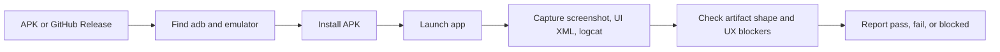

<div align="center">

# Android Release Emulator QA Skill

Validate Android release APKs with emulator evidence: install, launch, screenshot, UI XML, logcat, SHA256, and GitHub Release artifact checks.

[](#)
[](#)
[](https://mumu.163.com/360mumu/)
[](LICENSE)

[MuMu Download](https://mumu.163.com/360mumu/) · [Quick Start](#quick-start) · [Evidence Output](#evidence-output) · [Workflow](#workflow)

</div>

## Why This Exists

Release builds often "compile successfully" while still failing product QA: the APK opens with broken text, the first screen is unusable, a preview package diverges from the real package, or the Release uploads duplicate Android artifacts.

This skill gives Codex a reusable Android release QA loop. It is generic enough for any APK project and practical on Windows machines that use MuMu or another adb-compatible emulator.

## What It Checks

| Area | Evidence |
| --- | --- |
| Emulator setup | `adb` discovery, device list, optional TCP connect |
| APK integrity | file size and SHA256 |
| Install | `adb install -r -d` result |
| Launch | `am start` or `monkey` result |
| UI | screenshot and `uiautomator` XML |
| Runtime | recent `logcat` |
| Release hygiene | GitHub Release asset names, sizes, digests |

## Quick Start

Install or start an emulator first. Recommended Windows emulator:

https://mumu.163.com/360mumu/

Then run:

```powershell
python scripts/android_release_qa.py --apk path\to\app.apk --package com.example.app --output qa-output
```

If your emulator exposes adb over TCP:

```powershell
python scripts/android_release_qa.py --connect 127.0.0.1:7555 --apk app.apk --package com.example.app --output qa-output
```

Check a GitHub Release asset list:

```powershell
python scripts/android_release_qa.py --github-release Harzva/GitReleaseMarket@v0.1.9 --output qa-output
```

## Evidence Output

The script writes a portable QA folder:

```text
qa-output/
  summary.json
  adb-devices.json
  apk.json
  install.json
  launch.json
  screenshot.png
  window.xml
  logcat.txt
  github-release.json
```

Use the screenshot and UI XML before judging visual quality. Use the logcat and install/launch JSON before judging runtime stability.

## Workflow



## Install As A Codex Skill

Clone this repository into a Codex skills directory:

```powershell
git clone https://github.com/Harzva/android-release-emulator-qa-skill.git "$env:USERPROFILE\.codex\skills\android-release-emulator-qa-skill"
```

Or keep it in your own skill workspace and point Codex at the folder containing `SKILL.md`.

## Repository Structure

```text
SKILL.md
agents/openai.yaml
scripts/android_release_qa.py
references/emulator-setup.md
references/release-checklist.md
```

## Good Reports Look Like

Lead with the outcome:

- Status: pass, fail, or blocked.
- Device/emulator and adb serial.
- APK SHA256.
- Install and launch result.
- Screenshot path and log path.
- Product blockers: UI, content, release hygiene, compliance, or runtime.

## License

MIT
