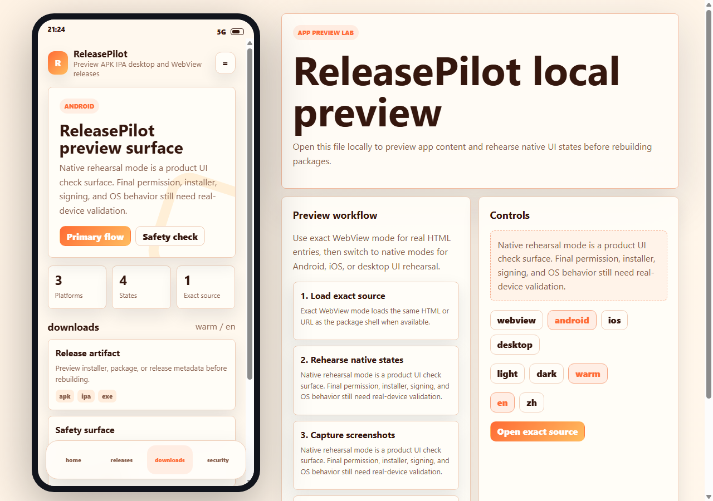

<div align="center">

# App Preview Lab

**Preview APK, IPA, desktop, and WebView app packages locally before rebuilding or reinstalling.**  
一个把移动端 / 桌面端安装包体验预演成可本地打开 HTML 的 Codex skill。


</div>

<p align="center">
  
</p>

## Why It Exists

Building a package, installing it on a phone, checking one UI problem, then repeating the loop is slow. App Preview Lab turns the package experience into a local preview surface:

- **Exact WebView preview**: load the same HTML or URL used by an APK/WebKit shell.
- **Native rehearsal**: preview Android, iOS, desktop, theme, language, route, download, and safety states before native code catches up.
- **Release QA surface**: show artifact names, versions, permissions, hashes, signatures, and upstream links in one browser-openable file.

It does not replace real-device validation. It reduces how often you need it.

## What You Get

| Layer | Included |
| --- | --- |
| Codex skill | `SKILL.md` and `agents/openai.yaml` |
| Preview template | `assets/templates/mobile-preview.html` |
| Generator | `scripts/create-preview.mjs` |
| Validator | `scripts/verify-preview.mjs` |
| Playbook | `references/preview-playbook.md` |
| README proof | Real screenshot generated from the template |

## Quick Start

Generate a preview page:

```bash
node scripts/create-preview.mjs \
  --name GitMarket \
  --tagline "Release discovery for open-source packages" \
  --app ./docs/app.html \
  --out ./docs/mobile-preview.html \
  --mode webview \
  --theme light \
  --lang zh
```

Verify the preview:

```bash
node scripts/verify-preview.mjs ./docs/mobile-preview.html
```

Open it directly in a browser:

```text
docs/mobile-preview.html?mode=android&theme=warm&lang=en&tab=downloads
```

## Preview Modes

| Mode | Use When | Truth Level |
| --- | --- | --- |
| `webview` | APK/WebKit shell points to an HTML file or URL | Exact content preview |
| `android` | Compose, egui, Flutter, or native Android UI is being designed | Native rehearsal |
| `ios` | SwiftUI/WebKit route is planned | Native rehearsal |
| `desktop` | exe/dmg/AppImage release needs user-facing preview | Desktop rehearsal |

## Skill Usage

Install or clone this repository into your Codex skills folder, then prompt:

```text
Use $app-preview-lab to create a local preview for this APK/WebView app and link it from README and GitHub Pages.
```

```text
Use $app-preview-lab to build an Android/iOS rehearsal page with theme, language, and download states before we package the app.
```

## Repository Map

```text
AppPreviewLab-Skill/
├─ SKILL.md
├─ agents/openai.yaml
├─ assets/
│  ├─ templates/mobile-preview.html
│  └─ previews/app-preview-lab.png
├─ references/preview-playbook.md
└─ scripts/
   ├─ create-preview.mjs
   └─ verify-preview.mjs
```

## Design Principles

- Label exact previews and native rehearsals separately.
- Keep previews local-openable and dependency-free.
- Add URL parameters for screenshot automation.
- Use realistic release data instead of placeholder cards.
- Document what still needs final Android, iOS, or desktop validation.

## License

MIT. Use it to make package QA faster, README screenshots clearer, and release previews easier to trust.
