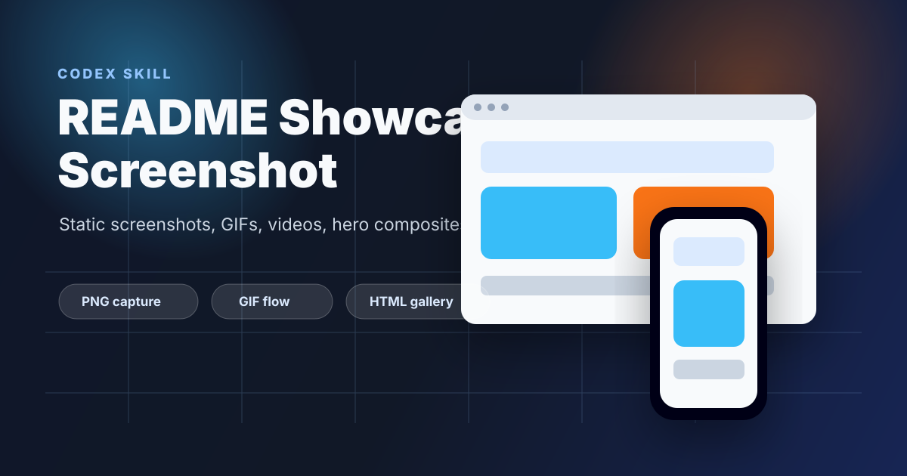
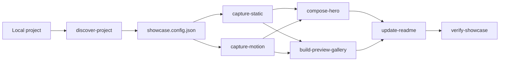

<p align="center">
  
</p>

<h1 align="center">README Showcase Screenshot</h1>

<p align="center">
  A Codex skill for turning local projects into polished GitHub README visuals: screenshots, GIFs, videos, hero composites, and interactive preview galleries.
</p>

<p align="center">
  
  
  
  
</p>

---

## Why This Exists

Many local projects already have working UI, but their README still depends on rushed screenshots, missing mobile views, oversized GIFs, or stale preview images. This skill standardizes that last mile: it captures the real local project, records short flows, builds a visual gallery, and updates a safe README block.

It is inspired by three useful patterns:

- Auto screenshot skills: Playwright-driven repeatable page capture.
- TaoQuickPreview-style preview repositories: curated GIF sections instead of one overloaded README.
- Browser automation skills: modular browser actions, visual feedback, and repeatable local workflows.

## What It Generates

| Asset | Output | Use |
| --- | --- | --- |
| Static screenshots | `docs/readme-assets/*.png` | Desktop, mobile, state, and component proof |
| Motion demos | `*.webm`, optional `*.mp4`, optional `*.gif` | README hero GIF or linked product demo |
| Hero composite | `hero.png` | First visual in README |
| Preview gallery | `gallery.html` | Full visual archive for docs, Pages, releases |
| Manifest | `manifest.json` | Traceable list of generated assets |
| README block | `<!-- showcase:start -->...` | Safe, repeatable README update |

## 30-second Flow

```bash
# from the target project root
node path/to/readme-showcase-screenshot/scripts/discover-project.mjs --write showcase.config.json

# edit showcase.config.json if needed, then:
node path/to/readme-showcase-screenshot/scripts/capture-static.mjs --config showcase.config.json
node path/to/readme-showcase-screenshot/scripts/capture-motion.mjs --config showcase.config.json
node path/to/readme-showcase-screenshot/scripts/compose-hero.mjs --config showcase.config.json
node path/to/readme-showcase-screenshot/scripts/build-preview-gallery.mjs --config showcase.config.json
node path/to/readme-showcase-screenshot/scripts/update-readme.mjs --config showcase.config.json
node path/to/readme-showcase-screenshot/scripts/verify-showcase.mjs --config showcase.config.json
```

Install browser support once:

```bash
npm install
npx playwright install chromium
```

Install `ffmpeg` if you want MP4/GIF conversion. Without it, motion capture still produces WebM.

## Config Example

```json
{
  "projectName": "My Product",
  "root": ".",
  "type": "vite",
  "startCommand": "pnpm run dev -- --host 127.0.0.1",
  "baseUrl": "http://127.0.0.1:5173",
  "outputDir": "docs/readme-assets",
  "readme": "README.md",
  "viewports": {
    "desktop": { "width": 1440, "height": 1000 },
    "mobile": { "width": 390, "height": 844, "isMobile": true, "deviceScaleFactor": 2 }
  },
  "screenshots": [
    { "id": "desktop-home", "title": "Desktop home", "path": "/", "viewport": "desktop" },
    { "id": "mobile-home", "title": "Mobile home", "path": "/", "viewport": "mobile" }
  ],
  "motions": [
    {
      "id": "hero-flow",
      "title": "Main product flow",
      "path": "/",
      "viewport": "desktop",
      "durationMs": 6000,
      "steps": [
        { "wait": 900 },
        { "scroll": 520 },
        { "wait": 1200 },
        { "scroll": -260 },
        { "wait": 900 }
      ]
    }
  ],
  "hero": {
    "title": "My Product",
    "subtitle": "README-ready preview captured from the live local project.",
    "images": ["desktop-home", "mobile-home"]
  }
}
```

## Workflow



## Skill Layout

```txt
readme-showcase-screenshot/
  SKILL.md
  scripts/
    discover-project.mjs
    capture-static.mjs
    capture-motion.mjs
    compose-hero.mjs
    build-preview-gallery.mjs
    update-readme.mjs
    verify-showcase.mjs
  references/
    config-schema.md
    motion-recipes.md
    readme-patterns.md
    troubleshooting.md
  assets/
    templates/
```

## Design Rules

- Keep the README curated; put the complete archive in `gallery.html`.
- Capture real UI states with loaded data whenever possible.
- Prefer one short GIF in README and MP4/WebM links for longer demos.
- Keep asset names stable so README diffs stay clean.
- Never commit auth state, cookies, tokens, or local `.env` data.

## References

- `references/config-schema.md`: full config fields and examples.
- `references/motion-recipes.md`: common animation and demo recipes.
- `references/readme-patterns.md`: README versus gallery decisions.
- `references/troubleshooting.md`: Playwright, auth, blank capture, and ffmpeg fixes.

## License

MIT
